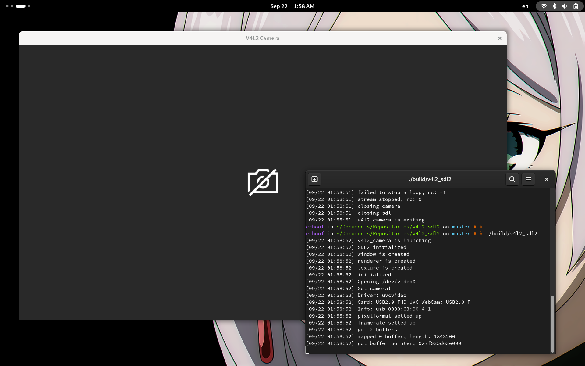

# V4L2 Camera

Simple application, that uses V4L2 to get video from /dev/video0 in YUV2 format and displays it via SDL2

## Libraries
- spdlog (Logging)

## Build
- Install SDL2 Dev library via package manager
- Get sources
```bash
git clone https://github.com/erhoof/v4l2_camera.git
git submodules init
```
- Compile
```
cd v4l2_camera
mkdir build
cmake ..
make
```
- Output file is v4l2_camera, execute it
```bash
./v4l2_camera
```

## Demo
